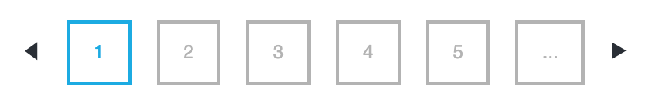

# MICS dataset repository

This is an [`orderly`](https://github.com/vimc/orderly) project to maintain 
a repository of datasets from the [Multiple Indicator Cluster Surveys (MICS)](https://mics.unicef.org/).

The directories are:

* `src`: R scripts for tasks to download the datasets.
* `archive`: versioned results of running tasks.

## Summary of tasks

#### `download_mics_datasets`

The task `download_mics_datasets` saves the following artefacts:

* A CSV `mics_survey_catalogue_filenames.csv` containing a list of all of the 
  MICS surveys and the URLs and file names.
* A folder `mics_datasets_raw` containing the raw ZIP files of survey datasets 
  available from (https://mics.unicef.org/surveys).

The workflow for parsing and downloading MICS survey datasets was developed
by [OJ Watson](https://github.com/OJWatson).

#### `mics_rds`

The task `convert_mics_rds` re-saves the MICS datasets as RDS files. It saves the
following artefacts:

* A CSV `mics_survey_catalogue.csv` with a list of all surveys and the assigned 
  location code and survey ID. The task assigns a `survey_id` to each survey 
  consisting of a three letter location code, survey year and suffix `MICS`. 
  For national surveys, the location code is the ISO3. For subnational surveys, 
  it is the first two letters of the ISO3 and a third letter, and checking that 
  it does not clash with assignd ISO3 codes.

* The folder `mics_datasets_rds` contains an RDS file for each survey dataset. The 
  RDS file consists of a list of data frames for each of the datasets contained 
  in the raw zip. SPSS datasets are imported via `haven:read_sav()` and saved as `
  haven_labelled` variables. If the raw dataset contained a `.txt` Readme file, 
  this is also saved in the list via `readLines()`. Early MICS surveys contained
  MS Word (`.doc`) Readme files. These are not parsed.

This exists as a separate task from `download_mics_datasets` so that errors or 
adjustments to the parsed RDS files can be fixed without re-downloading all raw
files.

## Creating or updating the archive

Creating the archive requires the `orderly` package:
```
install.packages("orderly")
```

The download paths for MICS datasets are not standardised and need to be generated
based on a CSV and parsing the html from the MICS website. Thus there are a few 
manual steps involved in creating the archive.

### Saving the _surveys_catalogue.csv_ file

Go to (https://mics.unicef.org/surveys). The page will be populated with a table 
of all of the MICS surveys. Click the _Export_ button in the top right corner. 


This will download a file _surveys_catalogue.csv_. Save this file in the 
directory `src/download_mics_datasets/`, overwriting the existing file.

_Note: it may be possible to automate this step in future development._


### Saving the survey webpage .html

Next, save the raw html for each of the pages of surveys in the directory 
`src/download_mics_datasets/htmls/`. To do this scroll to the bottom of the page 
and step through each of the pages of surveys .

On each page click _File_ then _Save Page As..._ to save the html.


### Updating the artefacts in the `orderly.yml`

Orderly requires that all files to be saved are explicitly named in the 
`orderly.yml`. The list of artefacts needs to be updated for any new 
surveys found.

Open the script `src/download_mics_dataset/script.R` and manually run the 
script down to the line:
```
yaml::write_yaml(yml, "orderly.yml")
```

This will overwrite the file `src/download_mics_dataset/orderly.yml` to 
include the list of available surveys.

Commit the changes to the `src/download_mics_dataset/` to git.


### Run the _orderly_ task

Finally, to update the archive wih any updated datasets, run the 
orderly command:
```
orderly::orderly_run("download_mics_dataset")
orderly::orderly_commit("<id>")
orderly::orderly_cleanup()
```

Then for datasets which are unchanged from the previous version, the following 
command will replace explicit copies of the dataset with hard links to the 
previous version:
```
orderly::orderly_deduplicate()
```
Thus, the new archive has a full set of the most recent datasets, but we are only
saving one copy of each dataset.

These hard links are the reason that datasets each ZIP is saved as an individual
artefact rather than a single dataset or ZIP.
